# THRESHOLD — Visual & Game Feel Polish Audit
**Pre-Submission Hackathon Polish Assessment & Execution Roadmap**

> **Audit Context**: Pre-submission visual review for *THRESHOLD*. Technical scope is **100% LOCKED**; core architecture and mechanics are complete. Time remaining: **~48 Hours**. Goal: Maximize visual impact, presentation quality, perceived polish, and game feel for hackathon judges without expanding technical scope, introducing 2D visual noise, or touching backend systems.

---

## 1. Executive Summary & Audit Methodology

As Visual Polish Director / Game Feel Designer, this audit evaluates the current build in [client](file:///c:/Users/User/Documents/THRESHOLD/client) against commercial 3D cozy indie benchmarks (*Animal Crossing*, *Short Hike*, *Donut County*). 

While the underlying technical foundation (Godot 4.7, Jolt 3D physics, ACES tonemapping, procedural bone animation, Animalese audio timeline synthesis) is robust, the current build suffers from **prototype friction**: raw unformatted debug strings in dialogue UI, static NPC posture, lack of subtle 3D lighting depth, and flat UI stat transitions.

By executing the streamlined **P0** and **P1** items below within the remaining 48 hours, *THRESHOLD* will achieve a refined, cohesive, and high-end 3D diorama aesthetic.

---

## 2. Comprehensive Itemized Polish Audit

### Priority Categorization
- **P0 — Must Do**: Highest visual impact and/or glaring weaknesses judges will immediately notice.
- **P1 — High Impact**: Strong visual/UX improvements that materially elevate production value.
- **P2 — Nice-to-Have**: Clean refinements to polish if time permits after P0/P1.
- **P3 — Don't Bother**: High effort/low impact items that should be explicitly skipped during the final 48h.

---

### [P0 — MUST DO]

#### P0-1: Raw Unformatted Debug String in Dialogue Sub-Info Bar
- **Priority**: P0
- **What is currently wrong**: The dialogue header sub-info label displays raw bracketed developer text: `[Role: Peer 👤 Tier: Stranger Mood: neutral]`.
- **Where it occurs**: [DialogueUI.gd:L204-L206](file:///c:/Users/User/Documents/THRESHOLD/client/scenes/ui/DialogueUI.gd#L25-L206) and [DialogueUI.tscn](file:///c:/Users/User/Documents/THRESHOLD/client/scenes/ui/DialogueUI.tscn).
- **Why it hurts the experience**: It immediately screams "unfinished developer debug text" to any judge within 3 seconds of entering conversation.
- **Exact improvement to make**:
  1. Replace raw string with stylized status pills using custom `StyleBoxFlat` containers with pill corner radii (`corner_radius = 12`).
  2. Format values neatly with distinct color tokens: Role in Slate Blue (`#4A6B82`), Tier in Amber (`#D97724`), Mood in Warm Emerald (`#2A9D8F`).
  3. Smoothly animate tier change transitions using `create_tween()` scale pulse (`1.0 -> 1.15 -> 1.0`).
- **Expected visual/game-feel impact**: Transforms developer status bar into a slick, diegetic RPG stat header.
- **Estimated difficulty**: Low (1/5)
- **Estimated time**: 20 Minutes
- **Dependencies**: None

#### P0-2: NPCs Static Head Direction & Lack of Player Attention
- **Priority**: P0
- **What is currently wrong**: Approaching an NPC displays a `GroundRing` and prompt, but the NPC's mesh remains completely static, facing a fixed world orientation until dialogue starts.
- **Where it occurs**: [NPC.gd:L108-L163](file:///c:/Users/User/Documents/THRESHOLD/client/scenes/templates/NPC.gd#L108-L163) and [NPC.tscn](file:///c:/Users/User/Documents/THRESHOLD/client/scenes/templates/NPC.tscn).
- **Why it hurts the experience**: NPCs feel like plastic mannequins or static level props rather than living town residents aware of the player's presence.
- **Exact improvement to make**:
  1. In `NPC.gd:_process()`, when player is within `interaction_radius`, calculate Y-angle to player: `var target_rot = atan2(dir.x, dir.z)`.
  2. Smoothly rotate `anim_head` or NPC mesh towards player using `lerp_angle(rotation.y, target_rot, 6.0 * delta)`.
  3. Add a micro `scale` bump (`Vector3(1.0, 1.08, 1.0) -> Vector3(1.0, 1.0, 1.0)`) when player first enters interaction radius (`show_prompt(true)`).
- **Expected visual/game-feel impact**: Massive jump in world immersion and character responsiveness.
- **Estimated difficulty**: Medium (2/5)
- **Estimated time**: 40 Minutes
- **Dependencies**: [Player3D.gd](file:///c:/Users/User/Documents/THRESHOLD/client/scenes/player/Player3D.gd) player position

#### P0-3: Lighting Depth, Glow & Post-Processing Atmosphere
- **Priority**: P0
- **What is currently wrong**: While `InteriorLighting.gd` enables SSAO and ACES tonemapping, `glow_enabled` is set to `false`, camera Depth of Field (DoF) is inactive, and environment shaders have high roughness (`0.85-0.95`) with zero fresnel rim lighting.
- **Where it occurs**: [InteriorLighting.gd:L135-L142](file:///c:/Users/User/Documents/THRESHOLD/client/scenes/rooms/InteriorLighting.gd#L135-L142), [threshold_visual_environment.tres](file:///c:/Users/User/Documents/THRESHOLD/client/visual/threshold_visual_environment.tres), [stylized_character.gdshader](file:///c:/Users/User/Documents/THRESHOLD/client/shaders/threshold/stylized_character.gdshader).
- **Why it hurts the experience**: Diorama scenes look slightly flat, characters blend into background furniture, and light sources (street lamps, desk lamps) lack warm bloom.
- **Exact improvement to make**:
  1. In `threshold_visual_environment.tres` and `InteriorLighting.gd`: Enable `glow_enabled = true`, set `glow_intensity = 0.4`, `glow_bloom = 0.15`, `glow_blend_mode = GLOW_BLEND_MODE_SOFTLIGHT`.
  2. Add subtle Depth of Field blur to cameras: `attributes.dof_blur_far_enabled = true`, `dof_blur_far_distance = 8.0`, `dof_blur_far_transition = 4.0`.
  3. Add a rim lighting term to `stylized_character.gdshader`:
     ```glsl
     float fresnel = pow(1.0 - clamp(dot(NORMAL, VIEW), 0.0, 1.0), 3.0);
     EMISSION = vec3(fresnel * 0.15) * albedo_color.rgb;
     ```
- **Expected visual/game-feel impact**: High-end cinematic 3D diorama look with warm glowing lights and crisp character silhouette pop.
- **Estimated difficulty**: Low (2/5)
- **Estimated time**: 45 Minutes
- **Dependencies**: Shader files & visual environment resource

#### P0-4: Grounded Tasteful 3D Atmospheric Particles (No 2D Arcade Effects)
- **Priority**: P0
- **What is currently wrong**: The 3D environment lacks subtle atmospheric depth.
- **Where it occurs**: Interior room templates ([RoomTemplate.gd](file:///c:/Users/User/Documents/THRESHOLD/client/scenes/rooms/RoomTemplate.gd)) and [Street.gd](file:///c:/Users/User/Documents/THRESHOLD/client/scenes/rooms/Street.gd).
- **Why it hurts the experience**: Air inside 3D rooms feels artificially sterile without ambient particles catching light rays.
- **Exact improvement to make**:
  1. **Strictly 3D & Minimal**: Do NOT add 2D screen-space confetti or arcade pop-up bursts that flatten the 3D diorama perspective.
  2. Create a single tasteful `AmbientDustMotes3D.tscn` (`GPUParticles3D` with slow-floating, low-opacity translucent 3D dots drifting subtly within room volumes).
  3. Create a subtle 3D ground level-up aura ring (`MeshInstance3D` torus/ring expanding smoothly along the floor around the 3D player model during milestone reveals).
- **Expected visual/game-feel impact**: Enhances 3D spatial depth and volume without cluttering the screen or feeling like a 2D arcade game.
- **Estimated difficulty**: Low (2/5)
- **Estimated time**: 45 Minutes
- **Dependencies**: 3D Environment scenes

---

### [P1 — HIGH IMPACT]

#### P1-1: Player Movement Camera & Rotation Strafe Tilt
- **Priority**: P1
- **What is currently wrong**: Player rotation turns instantly via linear lerp (`mesh_turn_speed = 12.0`), camera stays completely rigid, and traversal feels slightly stiff.
- **Where it occurs**: [Player3D.gd:L583-L604](file:///c:/Users/User/Documents/THRESHOLD/client/scenes/player/Player3D.gd#L583-L604).
- **Why it hurts the experience**: Movement feels rigid and mechanical rather than fluid and springy.
- **Exact improvement to make**:
  1. Add subtle character mesh Z-tilt on sharp turns: `character_mesh.rotation.z = lerp_angle(character_mesh.rotation.z, -raw_input.x * deg_to_rad(4.0), 10.0 * delta)`.
  2. Add micro camera lag/spring follow: lerp camera pivot Y offset slightly during movement.
  3. Add tiny 3D ground dust puffs (`GPUParticles3D` floor-constrained micro dust) during sprint loops.
- **Expected visual/game-feel impact**: Makes avatar traversal feel fluid, responsive, and satisfying in 3D space.
- **Estimated difficulty**: Medium (2/5)
- **Estimated time**: 50 Minutes
- **Dependencies**: [Player3D.gd](file:///c:/Users/User/Documents/THRESHOLD/client/scenes/player/Player3D.gd)

#### P1-2: Speech Bubble Overshoot Spring & Typing Dot Bounce
- **Priority**: P1
- **What is currently wrong**: Speech bubbles scale up linearly (`Vector2(0.8, 0.8) -> Vector2.ONE` in `0.25s`). Typing indicator dots `. . .` update via string replacement without vertical bouncing animation.
- **Where it occurs**: [SpeechBubble.gd:L87-L90](file:///c:/Users/User/Documents/THRESHOLD/client/scenes/ui/SpeechBubble.gd#L87-L90) and [DialogueUI.gd:L110-L118](file:///c:/Users/User/Documents/THRESHOLD/client/scenes/ui/DialogueUI.gd#L110-L118).
- **Why it hurts the experience**: Chat bubbles pop into existence abruptly; typing indicator feels static.
- **Exact improvement to make**:
  1. Change speech bubble scale tween ease to `TRANS_BACK` with overshoot: `tween.tween_property(self, "scale", Vector2.ONE, 0.28).set_trans(Tween.TRANS_BACK).set_ease(Tween.EASE_OUT)`.
  2. Animate typing dots using 3 small dot labels bouncing vertically with staggered sine offsets: `sin(time * 8.0 + idx * 0.5) * 4.0`.
- **Expected visual/game-feel impact**: Playful, lively narrative delivery comparable to top-tier cozy indie titles.
- **Estimated difficulty**: Low (2/5)
- **Estimated time**: 40 Minutes
- **Dependencies**: [SpeechBubble.gd](file:///c:/Users/User/Documents/THRESHOLD/client/scenes/ui/SpeechBubble.gd)

#### P1-3: 3D Avatar Preview in ID Card Modal Turntable Spin
- **Priority**: P1
- **What is currently wrong**: `IdCardUI.gd` clones the player's 3D avatar mesh into a `SubViewport`, but the model stands completely still in a static pose with no rotation or interaction.
- **Where it occurs**: [IdCardUI.gd:L87-L97](file:///c:/Users/User/Documents/THRESHOLD/client/scenes/ui/IdCardUI.gd#L87-L97) and [IdCardUI.tscn](file:///c:/Users/User/Documents/THRESHOLD/client/scenes/ui/IdCardUI.tscn).
- **Why it hurts the experience**: The 3D avatar viewport looks like a frozen snapshot or broken render texture.
- **Exact improvement to make**:
  1. In `IdCardUI.gd:_process()`, continuously rotate `model_pivot.rotation.y += 0.4 * delta` (slow 360 showcase turntable).
  2. Allow player mouse dragging across the preview frame to manually spin their character (`delta_x * 0.01`).
  3. Play idle breathing animation on the preview model skeleton.
- **Expected visual/game-feel impact**: Turns the ID card into a delightful interactive character showcase.
- **Estimated difficulty**: Low (2/5)
- **Estimated time**: 30 Minutes
- **Dependencies**: [IdCardUI.gd](file:///c:/Users/User/Documents/THRESHOLD/client/scenes/ui/IdCardUI.gd)

#### P1-4: Journal Notebook Blank Page Typography & Diegetic Watermark
- **Priority**: P1
- **What is currently wrong**: `JournalUI.gd` renders blank pages with raw text: `~ Page Intentionally Left Blank ~`.
- **Where it occurs**: [JournalUI.gd:L81](file:///c:/Users/User/Documents/THRESHOLD/client/scenes/ui/JournalUI.gd#L81) and [JournalUI.tscn](file:///c:/Users/User/Documents/THRESHOLD/client/scenes/ui/JournalUI.tscn).
- **Why it hurts the experience**: Raw text feels like placeholder wireframe text.
- **Exact improvement to make**:
  1. Replace blank page text with a subtle, clean diegetic notebook watermark stamp: `[center][color=#A08C78]✎\n\nObservations & Notes[/color][/center]`.
  2. Improve typography hierarchy with warm brown headers (`#3D2B1F`) and readable body contrast (`#1E150C`).
  3. *(Explicitly excluded per feedback: drop shadows & animated bookmark ribbons removed to keep UI flat and clean)*.
- **Expected visual/game-feel impact**: Clean, elegant diegetic notebook presentation without clutter.
- **Estimated difficulty**: Low (1/5)
- **Estimated time**: 20 Minutes
- **Dependencies**: [JournalUI.gd](file:///c:/Users/User/Documents/THRESHOLD/client/scenes/ui/JournalUI.gd)

#### P1-5: Turn Performance Recalculation Stat Counter Lerp
- **Priority**: P1
- **What is currently wrong**: In `DialogueUI.gd`, when `_recalculate_cumulative_performance()` calculates new scores, labels (`Overall: 75%`, `Clarity: 80%`) change instantly.
- **Where it occurs**: [DialogueUI.gd:L208-L260](file:///c:/Users/User/Documents/THRESHOLD/client/scenes/ui/DialogueUI.gd#L208-L260).
- **Why it hurts the experience**: Players don't notice their communication performance changing during dialogue.
- **Exact improvement to make**:
  1. Animate stat score counters using a lerp tween over `0.4s` (counting up/down smoothly: `50% -> 75%`).
  2. When score increases (`delta > 0`), spawn a green `+5% ↑` floating text pop near the stat badge.
  3. Play a soft pitch-shifted chime audio blip (`AudioManager.play_click()` pitched to `1.2`).
- **Expected visual/game-feel impact**: High satisfaction seeing real-time communication feedback.
- **Estimated difficulty**: Medium (2/5)
- **Estimated time**: 40 Minutes
- **Dependencies**: [DialogueUI.gd](file:///c:/Users/User/Documents/THRESHOLD/client/scenes/ui/DialogueUI.gd)

---

### [P2 — NICE-TO-HAVE]

#### P2-1: Main Menu Button Hover & Selection Feedback Enhancements
- **Priority**: P2
- **What is currently wrong**: Button hover effects in [MainMenu.gd:L48-L76](file:///c:/Users/User/Documents/THRESHOLD/client/scenes/main_menu/MainMenu.gd#L48-L76) scale buttons to `1.05`, but lack subtle rotation tilt or highlight glow.
- **Where it occurs**: [MainMenu.gd](file:///c:/Users/User/Documents/THRESHOLD/client/scenes/main_menu/MainMenu.gd), [MainMenu.tscn](file:///c:/Users/User/Documents/THRESHOLD/client/scenes/main_menu/MainMenu.tscn).
- **Exact improvement**: Add `-2.0°` hover tilt, button glow outline fade-in, and crisp audio feedback.
- **Estimated time**: 25 Minutes

---

### [P3 — DON'T BOTHER (Scope Protection for 48h Deadline)]

1. **Do NOT rewrite 3D Character Models / Meshes**: The current low-poly/stylized aesthetic works well with the toon shader. Replacing meshes carries severe rigging/UV risk.
2. **Do NOT overhaul Backend/API Logic**: The `ApiClient` and LLM integration in [ApiClient.gd](file:///c:/Users/User/Documents/THRESHOLD/client/singletons/ApiClient.gd) are 100% complete and working.
3. **Do NOT add new game modes or UI screens**: Adding new menus/tabs will dilute remaining polish time. Focus exclusively on dressing existing views.
4. **Do NOT add 2D Arcade Particles / Screen Overlay Bursts**: Keep all particles strictly 3D, ambient, and grounded.

---

## 3. 48-Hour Polish Plan (Execution Order)

To achieve maximum perceived quality improvement per minute spent, execute the changes in the following strict chronological order:

```mermaid
gantt
    title Streamlined 48-Hour Polish Execution Order
    dateFormat  HH:mm
    axisFormat %H:%M
    section Day 1: Core 3D Visuals & P0 Fixes
    P0-1 Dialogue Header Status Bar Refactor       :a1, 00:00, 20m
    P0-2 NPC Head Tracking & Attention Reaction     :a2, after a1, 40m
    P0-3 Lighting, Glow & DoF Post-Processing Pass  :a3, after a2, 45m
    P0-4 Grounded 3D Atmospheric Dust Motes & Aura :a4, after a3, 45m
    section Day 2: Juice & UX Elevation
    P1-1 Player Movement Tilt & Footstep Dust       :b1, 00:00, 50m
    P1-2 Speech Bubble & Typing Indicator Juice    :b2, after b1, 40m
    P1-3 ID Card 3D Avatar Viewport Turntable       :b3, after b2, 30m
    P1-4 Journal Notebook Watermark & Typography    :b4, after b3, 20m
    P1-5 Real-time Stat Counter Lerp & Floating Pops:b5, after b4, 40m
    P2-1 Main Menu Hover Refinements & Review       :b6, after b5, 30m
```



### Day 1 Execution (Total: ~2.5 Hours)
1. **Block 1 (P0-1)**: Fix Dialogue Header Status Bar ([DialogueUI.gd](file:///c:/Users/User/Documents/THRESHOLD/client/scenes/ui/DialogueUI.gd)). Remove developer debug strings.
2. **Block 2 (P0-2)**: Implement NPC Head Tracking & Proximity Attention ([NPC.gd](file:///c:/Users/User/Documents/THRESHOLD/client/scenes/templates/NPC.gd)).
3. **Block 3 (P0-3)**: Environment Lighting, Post-Processing Glow & DoF Pass ([InteriorLighting.gd](file:///c:/Users/User/Documents/THRESHOLD/client/scenes/rooms/InteriorLighting.gd)).
4. **Block 4 (P0-4)**: Add Grounded 3D Atmospheric Dust Motes & Player Floor Aura.

### Day 2 Execution (Total: ~3.5 Hours)
5. **Block 5 (P1-1)**: Add Player Movement Strafe Tilt & Footstep Dust ([Player3D.gd](file:///c:/Users/User/Documents/THRESHOLD/client/scenes/player/Player3D.gd)).
6. **Block 6 (P1-2)**: Speech Bubble Overshoot Spring & Typing Dot Bounce ([SpeechBubble.gd](file:///c:/Users/User/Documents/THRESHOLD/client/scenes/ui/SpeechBubble.gd)).
7. **Block 7 (P1-3)**: ID Card 3D Avatar Turntable & Drag Spin ([IdCardUI.gd](file:///c:/Users/User/Documents/THRESHOLD/client/scenes/ui/IdCardUI.gd)).
8. **Block 8 (P1-4)**: Journal Notebook Watermark & Clean Typography ([JournalUI.gd](file:///c:/Users/User/Documents/THRESHOLD/client/scenes/ui/JournalUI.gd)).
9. **Block 9 (P1-5)**: Live Stat Counter Lerps & Floating Stat Pops ([DialogueUI.gd](file:///c:/Users/User/Documents/THRESHOLD/client/scenes/ui/DialogueUI.gd)).
10. **Block 10 (P2-1)**: Main Menu Button Hover & Final Presentation Review.

---

## 4. Quick Wins (< 30 Minutes Each)

| Item | Description | Location | Est. Time |
| :--- | :--- | :--- | :--- |
| **QW-1** | Fix raw debug text in Dialogue Header sub-info bar | [DialogueUI.gd:L204](file:///c:/Users/User/Documents/THRESHOLD/client/scenes/ui/DialogueUI.gd#L204) | 20 Min |
| **QW-2** | Replace blank notebook string with clean diegetic watermark stamp | [JournalUI.gd:L81](file:///c:/Users/User/Documents/THRESHOLD/client/scenes/ui/JournalUI.gd#L81) | 20 Min |
| **QW-3** | Add 360° slow auto-turntable rotation to ID Card 3D Preview | [IdCardUI.gd:L87](file:///c:/Users/User/Documents/THRESHOLD/client/scenes/ui/IdCardUI.gd#L87) | 15 Min |
| **QW-4** | Enable Post-Processing Glow & Bloom in visual environment | [threshold_visual_environment.tres](file:///c:/Users/User/Documents/THRESHOLD/client/visual/threshold_visual_environment.tres) | 15 Min |
| **QW-5** | Add button hover tilt (`-2°`) and scale spring across UI | [MainMenu.gd:L48](file:///c:/Users/User/Documents/THRESHOLD/client/scenes/main_menu/MainMenu.gd#L48), [HUD.gd:L27](file:///c:/Users/User/Documents/THRESHOLD/client/scenes/ui/HUD.gd#L27) | 20 Min |

---

## 5. High-Impact Polish (30 Minutes – 1.5 Hours Each)

| Item | Description | Location | Est. Time |
| :--- | :--- | :--- | :--- |
| **HI-1** | **Grounded 3D Particles**: Add subtle 3D room dust motes catching ambient light and 3D floor ring aura on player milestone | [RoomTemplate.gd](file:///c:/Users/User/Documents/THRESHOLD/client/scenes/rooms/RoomTemplate.gd), [InteriorLighting.gd](file:///c:/Users/User/Documents/THRESHOLD/client/scenes/rooms/InteriorLighting.gd) | 45 Min |
| **HI-2** | **NPC Head Tracking & Proximity Reactions**: Smoothly rotate NPC head towards player upon approach with pop-in scale bounce | [NPC.gd:L108](file:///c:/Users/User/Documents/THRESHOLD/client/scenes/templates/NPC.gd#L108) | 40 Min |
| **HI-3** | **Player Movement Strafe Tilt & Footstep Juice**: Add character mesh z-tilt during sharp turns and micro 3D footstep dust | [Player3D.gd:L583](file:///c:/Users/User/Documents/THRESHOLD/client/scenes/player/Player3D.gd#L583) | 50 Min |
| **HI-4** | **Speech Bubble & Typing Dot Bounce**: Overshoot spring scale tweens for speech bubbles and animated bouncing typing dots | [SpeechBubble.gd:L87](file:///c:/Users/User/Documents/THRESHOLD/client/scenes/ui/SpeechBubble.gd#L87) | 40 Min |
| **HI-5** | **Live Stat Counter Lerps & Floating Stat Pops**: Animate encounter scores with counting lerp tweens and `+5% ↑` floating text | [DialogueUI.gd:L208](file:///c:/Users/User/Documents/THRESHOLD/client/scenes/ui/DialogueUI.gd#L208) | 40 Min |

---

## 6. Do Not Touch List

| Target Component | Reason to Exclude |
| :--- | :--- |
| **`ApiClient.gd` & Backend Routes** | Core networking is 100% complete and verified. Any edit risks breaking live LLM communications. |
| **Doorway Logic (`Door3D.gd`)** | Existing doorway triggers and scene switching logic remain untouched as requested. |
| **Street Foliage & Environmental Props** | Prop arrangements in `Street.gd` remain stable and unchanged. |
| **Pre-Encounter Perception Overlay (`PerceptionModal.gd`)** | Remains in current functional state without extra overlays. |
| **2D Arcade Particles / Screen Bursts** | Explicitly excluded to protect the clean 3D diorama aesthetic. |

---

## 7. Final Judge Experience Audit

### Current Experience (Before Polish Pass)
> *"A judge boots up THRESHOLD. In the main menu, clicking start launches a diorama room. Walking up to an NPC displays a prompt over an NPC who stands completely rigid, staring into space. Opening dialogue reveals a header bar reading `[Role: Peer 👤 Tier: Stranger Mood: neutral]`. When scores update, numbers snap instantly. It feels like a solid technical hackathon prototype, but visually rough around the edges."*

### Transformed Experience (After 48h Polish Pass)
> *"A judge boots up THRESHOLD. Main menu buttons tilt with crisp audio feedback. Entering the city street, warm ambient light pools glow under street lamps, soft 3D dust motes drift through interior rays, and subtle camera DoF frames the diorama. As the player walks toward Adler, the professor turns his head smoothly to make eye contact. Opening dialogue reveals a sleek status bar with vibrant pills. Speech bubbles overshoot into place with animated bouncing typing dots. When performance improves, numbers roll up smoothly while green floating score pops burst overhead. The 3D diorama world feels cohesive, responsive, and visually stunning."*

---
*Audit updated per user directives. All recommendations map directly to existing files in `/client/` without expanding technical scope.*
