# THRESHOLD — Visual & Game Feel Polish Audit
**Pre-Submission Hackathon Polish Assessment & Execution Roadmap**

> **Audit Context**: Pre-submission visual review for *THRESHOLD*. Technical scope is **100% LOCKED**; core architecture and mechanics are complete. Time remaining: **~48 Hours**. Goal: Maximize visual impact, presentation quality, perceived polish, and game feel for hackathon judges without expanding technical scope or touching backend systems.

---

## 1. Executive Summary & Audit Methodology

As Visual Polish Director / Game Feel Designer, this audit evaluates the current build in [client](file:///c:/Users/User/Documents/THRESHOLD/client) against commercial indie benchmarks (*Animal Crossing*, *Short Hike*, *Chicory*, *Donut County*). 

While the underlying technical foundation (Godot 4.7, Jolt 3D physics, ACES tonemapping, procedural bone animation, Animalese audio timeline synthesis) is robust, the current build suffers from **prototype friction**: raw unformatted debug strings in dialogue UI, static environment props, absence of particle effects ("juice"), rigid character turn/camera behavior, and flat UI micro-interactions.

Addressing the **P0** and **P1** items below within the remaining 48 hours will transform *THRESHOLD* from a "promising hackathon prototype" into a "stunning, awards-ready submission."

---

## 2. Comprehensive Itemized Polish Audit

### Priority Categorization
- **P0 — Must Do**: Highest visual impact and/or glaring weaknesses judges will immediately notice.
- **P1 — High Impact**: Strong visual/UX improvements that materially elevate production value.
- **P2 — Nice-to-Have**: Clean refinements to polish if time permits after P0/P1.
- **P3 — Don't Bother**: High effort/low impact items that should be explicitly skipped during the final 48h.

---

### [P0 — MUST DO]

#### P0-1: Raw Unformatted Debug String in Dialogue Sub-Info Bar
- **Priority**: P0
- **What is currently wrong**: The dialogue header sub-info label displays raw bracketed developer text: `[Role: Peer 👤 Tier: Stranger Mood: neutral]`.
- **Where it occurs**: [DialogueUI.gd:L204-L206](file:///c:/Users/User/Documents/THRESHOLD/client/scenes/ui/DialogueUI.gd#L25-L206) and [DialogueUI.tscn](file:///c:/Users/User/Documents/THRESHOLD/client/scenes/ui/DialogueUI.tscn).
- **Why it hurts the experience**: It immediately screams "unfinished developer debug text" to any judge within 3 seconds of entering conversation.
- **Exact improvement to make**:
  1. Replace raw string with stylized status pills using custom `StyleBoxFlat` containers with pill corner radii (`corner_radius = 12`).
  2. Format values neatly with distinct color tokens: Role in Slate Blue (`#4A6B82`), Tier in Amber (`#D97724`), Mood in Warm Emerald (`#2A9D8F`).
  3. Smoothly animate tier change transitions using `create_tween()` scale pulse (`1.0 -> 1.15 -> 1.0`).
- **Expected visual/game-feel impact**: Transforms developer status bar into a slick, diegetic RPG stat header.
- **Estimated difficulty**: Low (1/5)
- **Estimated time**: 20 Minutes
- **Dependencies**: None

#### P0-2: Doorway Entrances Are Invisible & Lack Visual Highlights
- **Priority**: P0
- **What is currently wrong**: `Door3D.gd` executes `_hide_door_visuals()` on `_ready()`, turning door meshes invisible. Floating 3D text `Press [E] to Enter` hovers in mid-air over blank floor space.
- **Where it occurs**: [Door3D.gd:L56-L64](file:///c:/Users/User/Documents/THRESHOLD/client/scenes/rooms/Door3D.gd#L56-L64) and [Door3D.tscn](file:///c:/Users/User/Documents/THRESHOLD/client/scenes/rooms/Door3D.tscn).
- **Why it hurts the experience**: Players cannot visually identify room transition boundaries without walking right into them; environment looks broken/unfinished.
- **Exact improvement to make**:
  1. Add a subtle ground warm light mat (`MeshInstance3D` quad with a warm gradient texture or `OmniLight3D` doorway welcoming pool).
  2. Add a gentle hovering downward arrow or door icon that bobs vertically (`sin(time * 4.0) * 0.1`).
  3. When player enters trigger area, fade in a soft glowing doorway arch frame outline (`modulate:a 0.0 -> 1.0` in `0.2s`).
- **Expected visual/game-feel impact**: Makes world navigation intuitive and visually inviting.
- **Estimated difficulty**: Low (2/5)
- **Estimated time**: 45 Minutes
- **Dependencies**: None

#### P0-3: NPCs Static Head Direction & Lack of Player Attention
- **Priority**: P0
- **What is currently wrong**: Approaching an NPC displays a `GroundRing` and prompt, but the NPC's mesh remains completely static, facing a fixed world orientation until dialogue starts.
- **Where it occurs**: [NPC.gd:L108-L163](file:///c:/Users/User/Documents/THRESHOLD/client/scenes/templates/NPC.gd#L108-L163) and [NPC.tscn](file:///c:/Users/User/Documents/THRESHOLD/client/scenes/templates/NPC.tscn).
- **Why it hurts the experience**: NPCs feel like plastic mannequins or static level props rather than living town residents aware of the player's presence.
- **Exact improvement to make**:
  1. In `NPC.gd:_process()`, when player is within `interaction_radius`, calculate Y-angle to player: `var target_rot = atan2(dir.x, dir.z)`.
  2. Smoothly rotate `anim_head` or NPC mesh towards player using `lerp_angle(rotation.y, target_rot, 6.0 * delta)`.
  3. Add a micro `scale` bump (`Vector3(1.0, 1.08, 1.0) -> Vector3(1.0, 1.0, 1.0)`) when player first enters interaction radius (`show_prompt(true)`).
- **Expected visual/game-feel impact**: Massive jump in world immersion and character responsiveness.
- **Estimated difficulty**: Medium (2/5)
- **Estimated time**: 40 Minutes
- **Dependencies**: [Player3D.gd](file:///c:/Users/User/Documents/THRESHOLD/client/scenes/player/Player3D.gd) player position

#### P0-4: Absence of Ambient & Milestone Particle Effects Across Entire Game
- **Priority**: P0
- **What is currently wrong**: There are literally **zero particle systems** in the entire client codebase. Level ups, successful encounter completions, street environment lamps, and room entrances have zero visual "juice".
- **Where it occurs**: Global across [Street.gd](file:///c:/Users/User/Documents/THRESHOLD/client/scenes/rooms/Street.gd), [OverviewModal.gd](file:///c:/Users/User/Documents/THRESHOLD/client/scenes/ui/OverviewModal.gd), [HUD.gd](file:///c:/Users/User/Documents/THRESHOLD/client/scenes/ui/HUD.gd), and [DialogueUI.gd](file:///c:/Users/User/Documents/THRESHOLD/client/scenes/ui/DialogueUI.gd).
- **Why it hurts the experience**: Game feels static and sterile. Milestone moments (Level Up, Good Outcome) feel flat without visual celebration.
- **Exact improvement to make**:
  1. Create a reusable `ConfettiBurst2D.tscn` (`CPUParticles2D` burst with colorful square quads, gravity, scale curve) for `OverviewModal.gd` level-up reveals.
  2. Create an `AmbientDustMotes3D.tscn` (`GPUParticles3D` with slow rising, translucent soft dots, box extent `Vector3(10, 4, 10)`) for interior room lighting.
  3. Create a `ClickBurst2D.tscn` micro-particle ripple on UI button presses.
- **Expected visual/game-feel impact**: Instantly adds professional polish and high-dopamine visual feedback.
- **Estimated difficulty**: Medium (2/5)
- **Estimated time**: 1.5 Hours
- **Dependencies**: None

#### P0-5: Lighting Depth & Post-Processing Atmosphere Needs Tuning
- **Priority**: P0
- **What is currently wrong**: While `InteriorLighting.gd` enables SSAO and ACES tonemapping, `glow_enabled` is set to `false`, camera Depth of Field (DoF) is inactive, and environment shaders have high roughness (`0.85-0.95`) with zero fresnel rim lighting.
- **Where it occurs**: [InteriorLighting.gd:L135-L142](file:///c:/Users/User/Documents/THRESHOLD/client/scenes/rooms/InteriorLighting.gd#L135-L142), [threshold_visual_environment.tres](file:///c:/Users/User/Documents/THRESHOLD/client/visual/threshold_visual_environment.tres), [stylized_character.gdshader](file:///c:/Users/User/Documents/THRESHOLD/client/shaders/threshold/stylized_character.gdshader).
- **Why it hurts the experience**: Diorama scenes look washed out, characters blend into background furniture, and light sources (street lamps, desk lamps) lack warm bloom.
- **Exact improvement to make**:
  1. In `threshold_visual_environment.tres` and `InteriorLighting.gd`: Enable `glow_enabled = true`, set `glow_intensity = 0.4`, `glow_bloom = 0.15`, `glow_blend_mode = GLOW_BLEND_MODE_SOFTLIGHT`.
  2. Add subtle Depth of Field blur to cameras: `attributes.dof_blur_far_enabled = true`, `dof_blur_far_distance = 8.0`, `dof_blur_far_transition = 4.0`.
  3. Add a rim lighting term to `stylized_character.gdshader`:
     ```glsl
     float fresnel = pow(1.0 - clamp(dot(NORMAL, VIEW), 0.0, 1.0), 3.0);
     EMISSION = vec3(fresnel * 0.15) * albedo_color.rgb;
     ```
- **Expected visual/game-feel impact**: High-end cinematic diorama look with warm glowing lights and crisp character silhouette pop.
- **Estimated difficulty**: Low (2/5)
- **Estimated time**: 45 Minutes
- **Dependencies**: Shader files & visual environment resource

---

### [P1 — HIGH IMPACT]

#### P1-1: Player Movement Camera & Rotation Lack Turn Tilt & Footstep Feedback
- **Priority**: P1
- **What is currently wrong**: Player rotation turns instantly via linear lerp (`mesh_turn_speed = 12.0`), camera stays completely rigid, and running produces no footstep dust or landing feedback.
- **Where it occurs**: [Player3D.gd:L583-L604](file:///c:/Users/User/Documents/THRESHOLD/client/scenes/player/Player3D.gd#L583-L604).
- **Why it hurts the experience**: Movement feels stiff and robotic rather than fluid and springy.
- **Exact improvement to make**:
  1. Add subtle character mesh Z-tilt on sharp turns: `character_mesh.rotation.z = lerp_angle(character_mesh.rotation.z, -raw_input.x * deg_to_rad(4.0), 10.0 * delta)`.
  2. Add micro camera lag/spring follow: lerp camera pivot Y offset slightly during sprint (`0.05` height bob).
  3. Spawn micro footstep puff (`CPUParticles3D` tiny dust cloud) at feet during sprint loops.
- **Expected visual/game-feel impact**: Makes avatar traversal feel alive, responsive, and satisfying.
- **Estimated difficulty**: Medium (2/5)
- **Estimated time**: 1 Hour
- **Dependencies**: [Player3D.gd](file:///c:/Users/User/Documents/THRESHOLD/client/scenes/player/Player3D.gd)

#### P1-2: Speech Bubble Entrance Animation & Typing Indicator Lack Bounce
- **Priority**: P1
- **What is currently wrong**: Speech bubbles scale up linearly (`Vector2(0.8, 0.8) -> Vector2.ONE` in `0.25s`). Typing indicator dots `. . .` update via string replacement without vertical bouncing animation.
- **Where it occurs**: [SpeechBubble.gd:L87-L90](file:///c:/Users/User/Documents/THRESHOLD/client/scenes/ui/SpeechBubble.gd#L87-L90) and [DialogueUI.gd:L110-L118](file:///c:/Users/User/Documents/THRESHOLD/client/scenes/ui/DialogueUI.gd#L110-L118).
- **Why it hurts the experience**: Chat bubbles pop into existence abruptly; typing indicator feels static.
- **Exact improvement to make**:
  1. Change speech bubble scale tween ease to `TRANS_BACK` with overshoot: `tween.tween_property(self, "scale", Vector2.ONE, 0.28).set_trans(Tween.TRANS_BACK).set_ease(Tween.EASE_OUT)`.
  2. Animate typing dots using 3 small dot sprites/labels bouncing vertically with staggered sine offsets: `sin(time * 8.0 + idx * 0.5) * 4.0`.
- **Expected visual/game-feel impact**: Playful, lively narrative delivery comparable to top-tier cozy indie titles.
- **Estimated difficulty**: Low (2/5)
- **Estimated time**: 45 Minutes
- **Dependencies**: [SpeechBubble.gd](file:///c:/Users/User/Documents/THRESHOLD/client/scenes/ui/SpeechBubble.gd)

#### P1-3: 3D Avatar Preview in ID Card Modal is Completely Static
- **Priority**: P1
- **What is currently wrong**: `IdCardUI.gd` clones the player's 3D avatar mesh into a `SubViewport`, but the model stands completely still in a static pose with no rotation or interaction.
- **Where it occurs**: [IdCardUI.gd:L87-L97](file:///c:/Users/User/Documents/THRESHOLD/client/scenes/ui/IdCardUI.gd#L87-L97) and [IdCardUI.tscn](file:///c:/Users/User/Documents/THRESHOLD/client/scenes/ui/IdCardUI.tscn).
- **Why it hurts the experience**: The 3D avatar viewport looks like a frozen snapshot or broken render texture.
- **Exact improvement to make**:
  1. In `IdCardUI.gd:_process()`, continuously rotate `model_pivot.rotation.y += 0.4 * delta` (slow 360 showcase turntable).
  2. Allow player mouse dragging across the preview frame to manually spin their character (`delta_x * 0.01`).
  3. Play idle breathing animation on the preview model skeleton.
- **Expected visual/game-feel impact**: Turns the ID card into a delightful interactive character showcase.
- **Estimated difficulty**: Low (2/5)
- **Estimated time**: 30 Minutes
- **Dependencies**: [IdCardUI.gd](file:///c:/Users/User/Documents/THRESHOLD/client/scenes/ui/IdCardUI.gd)

#### P1-4: Journal Notebook Blank Page Text & Styling Feels Like Wireframe
- **Priority**: P1
- **What is currently wrong**: `JournalUI.gd` renders blank pages with raw text: `~ Page Intentionally Left Blank ~` and uses default RichTextLabel fonts without hand-drawn notebook accents or bookmark ribbons.
- **Where it occurs**: [JournalUI.gd:L81](file:///c:/Users/User/Documents/THRESHOLD/client/scenes/ui/JournalUI.gd#L81) and [JournalUI.tscn](file:///c:/Users/User/Documents/THRESHOLD/client/scenes/ui/JournalUI.tscn).
- **Why it hurts the experience**: Breaks the diegetic illusion of holding a physical field journal.
- **Exact improvement to make**:
  1. Replace blank page text with a subtle stylized stamp graphic or hand-drawn sketch watermark: `[center][color=#A08C78]✎\n\nNotes & Sketches[/color][/center]`.
  2. Add subtle paper page edge drop shadows (`StyleBoxFlat` shadow on book spread container).
  3. Add animated bookmark ribbon tab on top edge of book spread.
- **Expected visual/game-feel impact**: Delivers a rich diegetic notebook experience.
- **Estimated difficulty**: Low (2/5)
- **Estimated time**: 35 Minutes
- **Dependencies**: [JournalUI.gd](file:///c:/Users/User/Documents/THRESHOLD/client/scenes/ui/JournalUI.gd)

#### P1-5: Pre-Encounter Perception Modal Lacks NPC Visual Portrait & Scene Vignette
- **Priority**: P1
- **What is currently wrong**: `PerceptionModal.gd` displays location, NPC name, role, and known facts as a plain text overlay card before dialogue starts.
- **Where it occurs**: [PerceptionModal.gd:L50-L76](file:///c:/Users/User/Documents/THRESHOLD/client/scenes/ui/PerceptionModal.gd#L50-L76) and [PerceptionModal.tscn](file:///c:/Users/User/Documents/THRESHOLD/client/scenes/ui/PerceptionModal.tscn).
- **Why it hurts the experience**: It feels like an informative pop-up modal rather than a dramatic narrative beat.
- **Exact improvement to make**:
  1. Add an NPC mood emoji / portrait preview icon badge inside the card header.
  2. Fade background screen to a deep cinematic vignette backdrop (`Color(0.05, 0.07, 0.12, 0.75)` with smooth alpha fade `0.3s`).
  3. Add a subtle slide-up entrance tween for the card: `position.y` shifts from `+40px` to `0px` with `TRANS_BACK`.
- **Expected visual/game-feel impact**: Elevates pre-encounter beats into dramatic storytelling moments.
- **Estimated difficulty**: Low (2/5)
- **Estimated time**: 40 Minutes
- **Dependencies**: [PerceptionModal.gd](file:///c:/Users/User/Documents/THRESHOLD/client/scenes/ui/PerceptionModal.gd)

#### P1-6: Turn Performance Recalculation Stats Update Instantly Without Counter Juice
- **Priority**: P1
- **What is currently wrong**: In `DialogueUI.gd`, when `_recalculate_cumulative_performance()` calculates new scores, labels (`Overall: 75%`, `Clarity: 80%`) change instantly.
- **Where it occurs**: [DialogueUI.gd:L208-L260](file:///c:/Users/User/Documents/THRESHOLD/client/scenes/ui/DialogueUI.gd#L208-L260).
- **Why it hurts the experience**: Players don't notice their communication performance changing during dialogue.
- **Exact improvement to make**:
  1. Animate stat score counters using a lerp tween over `0.4s` (counting up/down smoothly: `50% -> 75%`).
  2. When score increases (`delta > 0`), spawn a green `+5% ↑` floating text pop near the stat badge.
  3. Play a soft pitch-shifted chime audio blip (`AudioManager.play_click()` pitched to `1.2`).
- **Expected visual/game-feel impact**: High satisfaction seeing real-time communication feedback.
- **Estimated difficulty**: Medium (2/5)
- **Estimated time**: 45 Minutes
- **Dependencies**: [DialogueUI.gd](file:///c:/Users/User/Documents/THRESHOLD/client/scenes/ui/DialogueUI.gd)

---

### [P2 — NICE-TO-HAVE]

#### P2-1: Main Menu Button Hover & Selection Feedback Enhancements
- **Priority**: P2
- **What is currently wrong**: Button hover effects in [MainMenu.gd:L48-L76](file:///c:/Users/User/Documents/THRESHOLD/client/scenes/main_menu/MainMenu.gd#L48-L76) scale buttons to `1.05`, but lack subtle rotation tilt or highlight glow.
- **Where it occurs**: [MainMenu.gd](file:///c:/Users/User/Documents/THRESHOLD/client/scenes/main_menu/MainMenu.gd), [MainMenu.tscn](file:///c:/Users/User/Documents/THRESHOLD/client/scenes/main_menu/MainMenu.tscn).
- **Exact improvement**: Add `-2.0°` hover tilt, button glow outline fade-in, and light particle burst on click.
- **Estimated time**: 25 Minutes

#### P2-2: Street Outdoor Plants & Props Swaying Animations
- **Priority**: P2
- **What is currently wrong**: Outdoor decor props (`plant_01.gltf`, `plant_02.gltf`, bistro chairs) placed by `Street.gd` are completely motionless.
- **Where it occurs**: [Street.gd:L70-L121](file:///c:/Users/User/Documents/THRESHOLD/client/scenes/rooms/Street.gd#L70-L121).
- **Exact improvement**: Add vertex sway or subtle rotation oscillation (`sin(time * 2.0) * 1.5°`) to foliage props in `_process()`.
- **Estimated time**: 30 Minutes

#### P2-3: Main Menu Featured NPC Card Shimmer & Streak Icon Pulse
- **Priority**: P2
- **What is currently wrong**: `DailyCard` on the right side of Main Menu displays text statically.
- **Where it occurs**: [MainMenu.gd:L83-L98](file:///c:/Users/User/Documents/THRESHOLD/client/scenes/main_menu/MainMenu.gd#L83-L98).
- **Exact improvement**: Add a subtle pulsing scale loop (`1.0 -> 1.05 -> 1.0`) on the streak fire icon `🔥` and a soft background card shimmer gradient.
- **Estimated time**: 20 Minutes

---

### [P3 — DON'T BOTHER (Scope Protection for 48h Deadline)]

1. **Do NOT rewrite 3D Character Models / Meshes**: The current low-poly/stylized aesthetic works well with the toon shader. Replacing models carries severe rigging/UV risk.
2. **Do NOT overhaul Backend/API Logic**: The `ApiClient` and LLM integration in [ApiClient.gd](file:///c:/Users/User/Documents/THRESHOLD/client/singletons/ApiClient.gd) are 100% complete and working.
3. **Do NOT add new game modes or UI screens**: Adding new menus/tabs will dilute remaining polish time. Focus exclusively on dressing existing views.
4. **Do NOT add complex post-processing raytracing or SSGI**: Stick to compatibility-friendly SSAO, ACES tonemapping, and glow to maintain high 60 FPS performance on all judge devices.

---

## 3. 48-Hour Polish Plan (Execution Order)

To achieve maximum perceived quality improvement per minute spent, execute the changes in the following strict chronological order:

```mermaid
gantt
    title 48-Hour Polish Execution Order
    dateFormat  HH:mm
    axisFormat %H:%M
    section Day 1: Core Visuals & P0 Fixes
    P0-1 Dialogue Header Status Bar Refactor       :a1, 00:00, 30m
    P0-2 Doorway Entrance Visual Highlights         :a2, after a1, 45m
    P0-3 NPC Head Tracking & Attention Reaction     :a3, after a2, 45m
    P0-5 Lighting, Glow & DoF Post-Processing Pass  :a4, after a3, 45m
    P0-4 Particle System Framework & Bursts         :a5, after a4, 90m
    section Day 2: Juice & UX Elevation
    P1-1 Player Movement Tilt & Dust FX             :b1, 00:00, 60m
    P1-2 Speech Bubble & Typing Indicator Juice    :b2, after b1, 45m
    P1-3 ID Card 3D Avatar Viewport Turntable       :b3, after b2, 30m
    P1-4 Journal Notebook Visual Refinements        :b4, after b3, 35m
    P1-5 Perception Modal Dramatic Vignette & Slide :b5, after b4, 40m
    P1-6 Real-time Stat Counter Lerp & Floating Pops:b6, after b5, 45m
    P2 Quick Wins & Final Presentation Review       :b7, after b6, 60m
```



### Day 1 Execution (Total: ~4.5 Hours)
1. **Block 1 (P0-1)**: Fix Dialogue Header Status Bar ([DialogueUI.gd](file:///c:/Users/User/Documents/THRESHOLD/client/scenes/ui/DialogueUI.gd)). Remove developer debug strings.
2. **Block 2 (P0-2)**: Add Doorway Entrance Highlights ([Door3D.gd](file:///c:/Users/User/Documents/THRESHOLD/client/scenes/rooms/Door3D.gd)).
3. **Block 3 (P0-3)**: Implement NPC Head Tracking & Proximity Attention ([NPC.gd](file:///c:/Users/User/Documents/THRESHOLD/client/scenes/templates/NPC.gd)).
4. **Block 4 (P0-5)**: Environment Lighting, Post-Processing Glow & DoF Pass ([InteriorLighting.gd](file:///c:/Users/User/Documents/THRESHOLD/client/scenes/rooms/InteriorLighting.gd)).
5. **Block 5 (P0-4)**: Build Particle FX Framework (`ConfettiBurst2D`, `AmbientDustMotes3D`).

### Day 2 Execution (Total: ~4.5 Hours)
6. **Block 6 (P1-1)**: Add Player Movement Strafe Tilt & Footstep Dust ([Player3D.gd](file:///c:/Users/User/Documents/THRESHOLD/client/scenes/player/Player3D.gd)).
7. **Block 7 (P1-2)**: Speech Bubble Overshoot Spring & Typing Dot Bounce ([SpeechBubble.gd](file:///c:/Users/User/Documents/THRESHOLD/client/scenes/ui/SpeechBubble.gd)).
8. **Block 8 (P1-3)**: ID Card 3D Avatar Turntable & Drag Spin ([IdCardUI.gd](file:///c:/Users/User/Documents/THRESHOLD/client/scenes/ui/IdCardUI.gd)).
9. **Block 9 (P1-4)**: Journal Notebook Visual Touches ([JournalUI.gd](file:///c:/Users/User/Documents/THRESHOLD/client/scenes/ui/JournalUI.gd)).
10. **Block 10 (P1-5 & P1-6)**: Perception Modal Dramatic Card & Live Stat Counting Tweens.
11. **Block 11 (P2 Quick Wins)**: Final polish sweep on button hovers and menu card shimmers.

---

## 4. Quick Wins (< 30 Minutes Each)

| Item | Description | Location | Est. Time |
| :--- | :--- | :--- | :--- |
| **QW-1** | Fix raw debug text in Dialogue Header sub-info bar | [DialogueUI.gd:L204](file:///c:/Users/User/Documents/THRESHOLD/client/scenes/ui/DialogueUI.gd#L204) | 20 Min |
| **QW-2** | Add 360° slow auto-turntable rotation to ID Card 3D Preview | [IdCardUI.gd:L87](file:///c:/Users/User/Documents/THRESHOLD/client/scenes/ui/IdCardUI.gd#L87) | 15 Min |
| **QW-3** | Replace blank notebook string with stylized notebook stamp | [JournalUI.gd:L81](file:///c:/Users/User/Documents/THRESHOLD/client/scenes/ui/JournalUI.gd#L81) | 15 Min |
| **QW-4** | Enable Post-Processing Glow & Bloom in visual environment | [threshold_visual_environment.tres](file:///c:/Users/User/Documents/THRESHOLD/client/visual/threshold_visual_environment.tres) | 15 Min |
| **QW-5** | Add button hover tilt (`-2°`) and scale spring across UI | [MainMenu.gd:L48](file:///c:/Users/User/Documents/THRESHOLD/client/scenes/main_menu/MainMenu.gd#L48), [HUD.gd:L27](file:///c:/Users/User/Documents/THRESHOLD/client/scenes/ui/HUD.gd#L27) | 20 Min |

---

## 5. High-Impact Polish (30 Minutes – 3 Hours Each)

| Item | Description | Location | Est. Time |
| :--- | :--- | :--- | :--- |
| **HI-1** | **Particle Systems & Celebration Bursts**: Confetti burst on level-up, click ripples, and ambient dust motes in room interiors | [OverviewModal.gd](file:///c:/Users/User/Documents/THRESHOLD/client/scenes/ui/OverviewModal.gd), [Street.gd](file:///c:/Users/User/Documents/THRESHOLD/client/scenes/rooms/Street.gd) | 1.5 Hours |
| **HI-2** | **NPC Head Tracking & Proximity Reactions**: Smoothly rotate NPC head towards player upon approach with pop-in scale bounce | [NPC.gd:L108](file:///c:/Users/User/Documents/THRESHOLD/client/scenes/templates/NPC.gd#L108) | 45 Min |
| **HI-3** | **Player Movement Strafe Tilt & Footstep Juice**: Add character mesh z-tilt during sharp turns and footstep dust particles | [Player3D.gd:L583](file:///c:/Users/User/Documents/THRESHOLD/client/scenes/player/Player3D.gd#L583) | 1 Hour |
| **HI-4** | **Doorway Entrances Visual Redesign**: Add glowing entrance light pools, floating bobbing icons, and arch highlights | [Door3D.gd:L56](file:///c:/Users/User/Documents/THRESHOLD/client/scenes/rooms/Door3D.gd#L56) | 45 Min |
| **HI-5** | **Live Stat Counter Lerps & Floating Stat Pops**: Animate encounter scores with counting lerp tweens and `+5% ↑` floating text | [DialogueUI.gd:L208](file:///c:/Users/User/Documents/THRESHOLD/client/scenes/ui/DialogueUI.gd#L208) | 45 Min |

---

## 6. Do Not Touch List

| Target Component | Reason to Exclude |
| :--- | :--- |
| **`ApiClient.gd` & Backend Routes** | Core networking is 100% complete and verified. Any edit risks breaking live LLM communications. |
| **Character 3D Mesh Files (`.gltf`)** | Rigging, bone weights, and blend shapes are established. Replacing meshes will break customizer scaling. |
| **Jolt 3D Physics Configuration** | Physics boundaries and collisions are working cleanly without glitches. |
| **Animalese Audio Frequency Math** | Procedural Animalese audio timeline synthesis is calibrated; modifying base frequencies risks audio distortion. |

---

## 7. Final Judge Experience Audit

### Current Experience (Before Polish Pass)
> *"A judge boots up THRESHOLD. The title splash takes 5 seconds of unskippable logo fades. In the main menu, clicking start launches a diorama room. Walking up to an NPC shows a floating line of text over an NPC who stands completely rigid, staring into space. Opening dialogue reveals a header bar reading `[Role: Peer 👤 Tier: Stranger Mood: neutral]`. When scores update, numbers snap instantly. Walking into doorways feels like hitting invisible warp triggers. It feels like a solid technical hackathon prototype, but visually rough around the edges."*

### Transformed Experience (After 48h Polish Pass)
> *"A judge boots up THRESHOLD. Main menu buttons tilt with crisp audio feedback. Entering the city street, warm ambient light pools glow under street lamps, soft dust motes float through the air, and subtle camera DoF frames the diorama. As the player walks toward Adler, the professor turns his head smoothly to make eye contact, his mood emoji popping up with a bouncy scale spring. Opening dialogue reveals a sleek status bar with vibrant pills. Speech bubbles overshoot into place with animated bouncing typing dots. When performance improves, numbers roll up smoothly while green floating score pops burst overhead. Leaving the encounter triggers a celebratory confetti explosion. The game feels like a commercially released indie title."*

---
*Audit completed by Visual Polish Director / Game Feel Designer. All recommendations map directly to existing files in `/client/` without expanding technical scope.*
