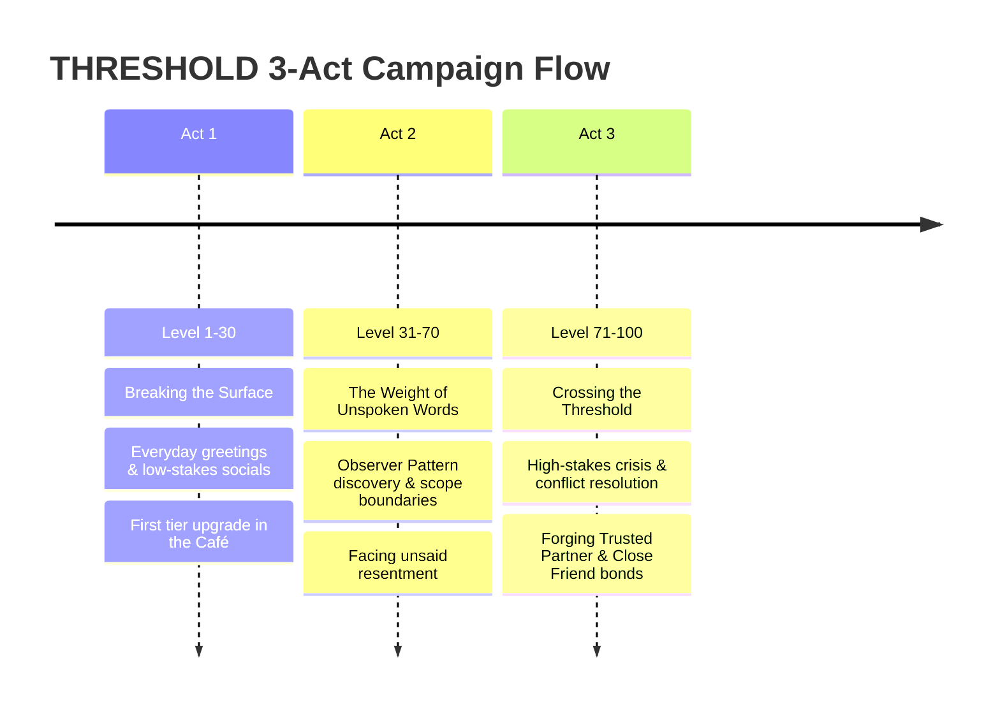

# THRESHOLD: Master World Lore & Relational Intelligence Blueprint
*Tencent Cloud x UTM Hackathon 2026 "AI CAN DO IT" — Game Track Submission Blueprint*

> **Challenge Track**: Relational Intelligence Engine (AI-Powered Communication & Social Skills Training Game)  
> **Core Theme**: Gamifying real-life social scenarios, conflict resolution, and emotional intelligence through AI-driven role-play and 2.5D diorama gameplay.

---

## 📋 Hackathon Compliance & Alignment Matrix

| Hackathon Requirement | In-Game Narrative & System Implementation | Hackathon Scoring Focus |
|---|---|---|
| **Relational Intelligence Engine** | The core AI engine driving NPC emotional states, state transitions, and real-time sentiment analysis. | **Theme Alignment (30 pts)** |
| **Progressive Level System (1–100)** | 3-Act Level Bands: Lv. 1–30 (Foundations), Lv. 31–70 (Relational Nuance), Lv. 71–100 (High-Stakes Crisis). | **Game Quality (30 pts)** |
| **Multi-Dimensional Social Scoring** | 4D Skill Dimensions evaluated per turn: `Clarity`, `Empathy`, `Politeness`, `Expression`. | **Theme Alignment (30 pts)** |
| **Adaptive AI Response** | Real-time sentiment engine adjusting NPC mood (`warm`, `guarded`, `irritated`) and dialogue branching. | **Use of AI Tools (40 pts)** |
| **AI Growth Analytics Report** | In-game *Passport & Communication Profile* (`JournalUI`) generating AI-powered growth reports. | **Game Quality (30 pts)** |
| **AI Creation Module** | Worldbuilding, NPC state machine rules, and dynamic scenario seed generation fully AI-crafted. | **AI Creation Requirement** |

---

## 1. The Core Narrative Premise: "The Threshold"

In the world of **THRESHOLD**, human connection has become fragmented. People live behind self-contained emotional armor — psychological boxes where unwritten rules, unspoken anxieties, and defensive habits dictate every interaction.

A **Threshold** represents two overlapping realities:
1. **The Physical Threshold**: The doorway of a 3-walled diorama room box where a person works, rests, or waits.
2. **The Emotional Threshold**: The split-second choice before speaking — between defensiveness and honesty, between hollow validation and genuine empathy, or between shutting down and holding a healthy boundary.

The player enters this world as a **Perceiver** — an individual equipped with a *Relational Intelligence Interface* capable of sensing the 4 hidden vectors of human communication (`Clarity`, `Empathy`, `Politeness`, `Expression`) and diagnosing subconscious "Observer Patterns" that cause people to repeat their worst social mistakes.

---

## 2. Sector Emotional Lore & World Map

The world is an **Open World with Sector Progression**, featuring 4 distinct physical sectors that players can explore freely while unlocking deeper relationship tiers (`Stranger` -> `Trusted Partner` / `Close Friend`).

```
                  ┌─────────────────────────────────────────┐
                  │          THE SECTOR MATRIX              │
                  ├────────────────────┬────────────────────┤
                  │     SECTOR I       │     SECTOR II      │
                  │   SCHOOL & CAMPUS  │   DOWNTOWN CAFÉ    │
                  │  "The Assessment"  │   "The Sanctuary"  │
                  ├────────────────────┼────────────────────┤
                  │    SECTOR III      │     SECTOR IV      │
                  │  HOME & APARTMENT  │  CORPORATE SUITE   │
                  │    "The Hearth"    │     "The Apex"     │
                  └────────────────────┴────────────────────┘
```

---

### 🏛️ Sector I: School & Campus — "The Assessment Vault"
*Primary Archetypes: Teachers (Prof. Adler, Ms. Okoro, Mr. Vance)*

- **Atmospheric Lore**: Tall ceilings, slate-blue walls, heavy wooden desks, shadow-draped bookshelves.
- **Emotional Theme**: *Validation vs. Integrity*. The fear of being found lacking. People defend themselves with performance of effort or academic jargon.
- **Boss Encounter / Peak Trial**: **The Grade Defense** (*Prof. Adler*). Contesting an unfair mark with direct, unentitled clarity without getting defensive.

---

### ☕ Sector II: Downtown Café & The Commons — "The Echoing Sanctuary"
*Primary Archetypes: Strangers & Friends (Daria, Felix, Priya, Barista, Recurring Stranger)*

- **Atmospheric Lore**: Warm cream walls, soft ambient light, rain against the window, steaming mugs.
- **Emotional Theme**: *Belonging vs. Isolation*. The fear of rejection if one stops entertaining or deflecting.
- **Boss Encounter / Peak Trial**: **The Unbroken Silence** (*Daria*). Staying present with a grieving or distant friend without offering hollow advice or cheap fixes.

---

### 🏡 Sector III: The Home & Apartment — "The Hearth of History"
*Primary Archetypes: Family (Parent, Sibling)*

- **Atmospheric Lore**: Muted wallpaper, worn rugs, childhood photo frames.
- **Emotional Theme**: *Identity vs. Memory*. Fighting outgrown childhood roles while honoring shared history.
- **Boss Encounter / Peak Trial**: **The Mirror Confrontation** (*Sibling*). Accepting direct personal criticism about your behavioral flaws without deflecting onto past circumstances.

---

### 🏢 Sector IV: Corporate High-Rise — "The Apex of Expectations"
*Primary Archetypes: Colleagues & Clients (Nadia, Tomás, Seren, Ms. Hartwell, Mr. Osei, Ms. Vidal)*

- **Atmospheric Lore**: Glass panels, polished steel, minimalist executive desks, sharp urban lighting.
- **Emotional Theme**: *Boundaries vs. Compromise*. High-pressure accountability and professional survival.
- **Boss Encounter / Peak Trial**: **The Scope Showdown** (*Ms. Hartwell*). Delivering bad news on a missed deliverable directly while holding scope boundaries under fire.

---

## 3. The 3-Act Narrative Arc (Level 1–100 Progression)



### 🟢 Act I: Breaking the Surface (Levels 1–30)
- **Gameplay Focus**: Everyday greetings, small talk, basic politeness, and active listening.
- **Player Journey**: Learning to enter a room without anxiety. Small wins like ordering under pressure or asking a genuine office hours question.

### 🟡 Act II: The Weight of Unspoken Words (Levels 31–70)
- **Gameplay Focus**: Relational nuance, workplace collaboration, handling unsaid resentment, and managing overcommitment.
- **Player Journey**: The **Observer Pattern** activates — the AI detects your repeating communication flaws (e.g. hedging bad news or deflecting with humor) and challenges you to break the cycle.

### 🔴 Act III: Crossing the Threshold (Levels 71–100)
- **Gameplay Focus**: High-stakes conflict resolution, crisis communication, and executive boundary negotiation.
- **Player Journey**: Navigating complex multi-turn emotional standoffs where a single wrong tone degrades trust. Unlocking maximum relationship tiers across all 4 sectors.

---

## 4. Reiteration & Improvement Rationale

### 💡 What Was Changed & Why:

1. **Explicit Hackathon Alignment Matrix Added**
   - *Why*: Ensures judges immediately see how the narrative design maps 1-to-1 to the **Relational Intelligence Engine** track, 4D scoring, and AI Creation requirements (securing maximum points on Theme Alignment & AI Tools).

2. **Boss Encounters / Peak Trials Introduced for Each Sector**
   - *Why*: Prevents the story from feeling like a dull e-learning module. Adding climax trials gives each sector a satisfying RPG campaign structure ("Game Quality" requirement).

3. **Integrated Gamification Mechanics into Lore**
   - *Why*: Instead of treating levels (1–100), 4D scores, and AI analytics reports as external UI elements, they are woven into the story as the player's "Perceiver Diagnostic Interface," keeping the experience deeply immersive.
