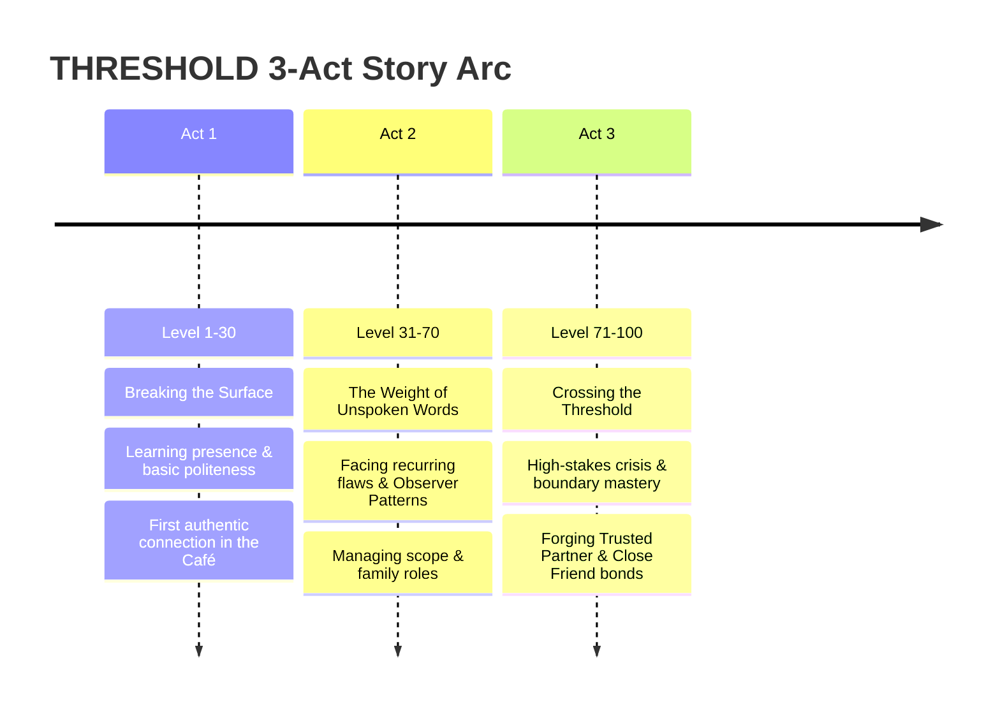

# THRESHOLD: World Lore & Narrative Progression Blueprint
*The Master Narrative World Bible & Player Journey Framework for Level Design*

---

## 1. The Core Narrative Premise: "The Threshold"

In the world of **THRESHOLD**, human connection has become fragmented under the weight of implicit expectations, unspoken anxieties, and defensive social armor. People live inside self-contained emotional micro-environments — psychological boxes where unwritten rules dictate every interaction.

A **Threshold** represents two overlapping realities:
1. **The Physical Threshold**: The doorframe of a 3-walled diorama room box where a person works, rests, or waits.
2. **The Emotional Threshold**: The exact moment of hesitation before a person speaks — the split-second choice between defensiveness and honesty, between hollow validation and genuine empathy, or between shutting down and holding a healthy boundary.

The player enters this world as a **Perceiver** — someone capable of sensing the hidden vectors of communication (`Clarity`, `Empathy`, `Politeness`, `Expression`) and perceiving the hidden "Observer Patterns" that cause people to repeat their worst relational habits.

---

## 2. Sector Emotional Lore & Physical World Map

The physical world of THRESHOLD is divided into **4 Core Sectors**, each representing a fundamental arena of human relationship:

```
                  ┌─────────────────────────────────────────┐
                  │          THE SECTOR MATRIX              │
                  ├────────────────────┬────────────────────┤
                  │     SECTOR I       │     SECTOR II      │
                  │   SCHOOL & CAMPUS  │   DOWNTOWN CAFÉ    │
                  │  "The Assessment"  │   "The Sanctuary"  │
                  ├────────────────────┼────────────────────┤
                  │    SECTOR III      │     SECTOR IV      │
                  │  HOME & APARTMENT  │  CORPORATE SUITE   │
                  │    "The Hearth"    │     "The Apex"     │
                  └────────────────────┴────────────────────┘
```

---

### 🏛️ Sector I: School & Campus — "The Assessment Vault"
*Primary Archetypes: Teachers (Prof. Adler, Ms. Okoro, Mr. Vance)*

- **Atmospheric Lore**: Tall ceilings, slate-blue walls, heavy wooden desks, and shadow-draped bookshelves. The air smells of paper, coffee, and quiet judgment.
- **The Emotional Theme**: *Validation vs. Integrity*. The fear of being found lacking or incompetent. People here defend themselves with academic jargon, performance of effort, or preemptive defensiveness.
- **The Core World Question**: *"Can you state your truth without performing for approval?"*
- **Room Layout Blueprint**:
  - `Room_Campus_Lobby`: The gateway connector.
  - `Room_Adler_Office`: High-contrast, narrow desk box. Formal and intimidating.
  - `Room_Okoro_Classroom`: Open seating, warm lighting, high expectation tension.

---

### ☕ Sector II: Downtown Café & The Commons — "The Echoing Sanctuary"
*Primary Archetypes: Strangers & Friends (Daria, Felix, Priya, Barista, Recurring Stranger)*

- **Atmospheric Lore**: Warm cream walls, soft ambient light, steaming mugs, and rain against the window. A space where people come to feel less alone without having to admit they are.
- **The Emotional Theme**: *Belonging vs. Isolation*. The tension between wanting to be truly known and fearing rejection if one stops entertaining or deflecting.
- **The Core World Question**: *"Can you sit in silence without trying to fix or deflect?"*
- **Room Layout Blueprint**:
  - `Room_Cafe_Main`: Open counters, soft couches, window-side booths.
  - `Room_Park_Bench`: Outdoor diorama box with streetlamp and falling leaves.

---

### 🏡 Sector III: The Home & Apartment — "The Hearth of History"
*Primary Archetypes: Family (Parent, Sibling)*

- **Atmospheric Lore**: Muted wallpaper, worn rugs, childhood artifacts, and nostalgic trinkets. The most emotionally charged space in the game.
- **The Emotional Theme**: *Identity vs. Memory*. Fighting against outgrown roles assigned years ago versus honoring shared history without absorbing past toxicity.
- **The Core World Question**: *"Can you meet the people who raised you as the person you are today?"*
- **Room Layout Blueprint**:
  - `Room_Apartment_Living`: Family couch, kitchen counter backdrop, old photo frames.
  - `Room_Shared_Balcony`: Quiet side space for direct 1-on-1 sibling encounters.

---

### 🏢 Sector IV: Corporate High-Rise — "The Apex of Expectations"
*Primary Archetypes: Colleagues & Clients (Nadia, Tomás, Seren, Ms. Hartwell, Mr. Osei, Ms. Vidal)*

- **Atmospheric Lore**: Glass panels, polished steel, minimalist executive desks, sharp lighting. Imposing, functional, and unforgiving.
- **The Emotional Theme**: *Boundaries vs. Compromise*. High-pressure accountability, scope creep, and professional survival.
- **The Core World Question**: *"Can you hold your boundaries without losing your humanity?"*
- **Room Layout Blueprint**:
  - `Room_Corporate_Lobby`: Clean glass walls, reception counter.
  - `Room_Executive_Suite`: Deep mahogany desk, panoramic city backdrop (Ms. Hartwell).
  - `Room_Conference_Small`: Tight glass room for colleague negotiations (Tomás / Nadia).

---

## 3. The 3-Act Narrative Arc & Player Journey

The overarching story of THRESHOLD unfolds across **3 Interconnected Acts**, mapping directly to player Level Bands:



---

### 🟢 Act I: Breaking the Surface (Levels 1–30)
- **Narrative Focus**: *Overcoming Social Hesitation & Basic Decency*.
- **Story Movement**: The player starts as an outsider moving between everyday social encounters — ordering coffee, asking a simple question in office hours, or sitting with a quiet friend.
- **Key Conflict**: The urge to give hollow validation, deflect with humor, or run away from awkward silences.
- **Act Climax**: Earning your first relationship tier upgrade (e.g., Barista becoming `Recognizes You` or Daria opening up about her feelings).

---

### 🟡 Act II: The Weight of Unspoken Words (Levels 31–70)
- **Narrative Focus**: *Relational Nuance, Scope Creep & Subconscious Patterns*.
- **Story Movement**: Interpersonal dynamics become layered. Teachers demand real engagement; colleagues quietly hold grudges over credit; clients push scope boundaries; parents ask heavy questions about the future.
- **Key Conflict**: The **Observer Pattern** triggers for the first time. The game's underlying Observer system flags your repeated communication flaws (e.g., repeatedly deflecting onto circumstances or absorbing resentment silently).
- **Act Climax**: Confronting your sibling or a key client (`Ms. Hartwell`) with clear boundaries without losing warmth or getting defensive.

---

### 🔴 Act III: Crossing the Threshold (Levels 71–100)
- **Narrative Focus**: *High-Pressure Crisis, Repairing Fractures & Genuine Mastery*.
- **Story Movement**: High-stakes scenarios dominate. Delivering bad news early on missed deliverables, disputing a grade with Prof. Adler, or addressing deep-seated family arguments.
- **Key Conflict**: The risk of permanent relationship degradation if bad news is vague or entitled.
- **Act Climax**: Reaching maximum Relationship Tiers (`Regarded Highly`, `Close Friend`, `Deeply Connected`, `Trusted Partner`) across all 4 Sectors, unlocking complete communication mastery.

---

## 4. World Layout & Room Connection Blueprint

To implement this lore into your physical scene flow:

```
[ Room_Start (Campus Entry) ] ──Door──> [ Room_Office (Prof. Adler) ]
            │
          Door
            ▼
[ Room_Cafe (Downtown Sector) ] ──Door──> [ Room_Apartment (Home Sector) ]
            │
          Door
            ▼
[ Room_Corporate (Suite Sector) ]
```

### Design Rules for World Construction:
1. **Diorama Frame Integrity**: Every room box maintains a 16:9 aspect ratio frame.
2. **Atmospheric Lighting Shifts**: As relationship trust increases with the primary NPC in a room, the room's ambient light smoothly shifts from cool slate blue (`#121b2d`) to warm golden cream (`#fff5e6`).
3. **Threshold Door Transitions**: Passing through a door locks player controls briefly, fades through a soft neutral transition, and places the player at the target `SpawnMarker3D`.

---

## 5. Summary Matrix for Level & Room Designers

| Sector | Primary NPC | Core Metric | Primary Skill | Signature Scenario |
|---|---|---|---|---|
| **Campus** | Prof. Adler | Respect | Clarity | *Disputing a Grade* (`grade_dispute_quiet`) |
| **Campus** | Ms. Okoro | Integrity | Empathy | *Asking for a Reference* (`recommendation_letter_ask`) |
| **Café** | Daria | Closeness | Expression | *Cancelled Again* (`you_cancelled_again`) |
| **Café** | Barista | Impression | Politeness | *Rush Order* (`ordering_under_pressure`) |
| **Home** | Parent | Closeness | Expression | *What's the Plan* (`parent_asking_about_the_plan`) |
| **Home** | Sibling | Trust | Empathy | *Called Out* (`sibling_pushing_back`) |
| **Corporate** | Ms. Hartwell | Satisfaction | Clarity | *Telling Them First* (`client_bad_news_early`) |
| **Corporate** | Tomás | Alignment | Clarity | *Left Off Presentation* (`credit_not_given`) |
