# THRESHOLD: Storyline & World Progression Map
*A Comprehensive Master Blueprint of World Sectors, Level Bands, NPC Tracks, and Scenario Arcs*

---

## 1. World Structure: Open World with Sector Progression

**THRESHOLD** features an **Open World with Sector Progression** model. Players can freely travel between all 4 major physical sectors from the very beginning. Each sector contains distinct NPC archetypes and diorama room locations. 

While exploration is open, the depth of conversation, relationship trust, and social complexity naturally evolve as the player advances through **3 Progression Level Bands** (Level 1 to 100).

```
 ┌─────────────────────────────────────────────────────────────────────────────┐
 │                           THE WORLD OF THRESHOLD                            │
 ├───────────────────┬───────────────────┬───────────────────┬─────────────────┤
 │  SCHOOL / CAMPUS  │   DOWNTOWN CAFÉ   │  HOME / APARTMENT │ CORPORATE OFFICE│
 │   (Teacher NPCs)  │   (Stranger NPCs) │    (Family NPCs)  │(Colleague/Client│
 └───────────────────┴───────────────────┴───────────────────┴─────────────────┘
```

---

## 2. Progression System & Level Bands

Player growth is driven by **XP gains** and **4D Skill Dimensions** (`Clarity`, `Empathy`, `Politeness`, `Expression`). Backend weighted distribution bands control scenario selection dynamically:

```mermaid
gantt
    title THRESHOLD Progression Level Bands
    dateFormat  X
    axisFormat %s
    section Band 1 (Lvl 1-30)
    Everyday Socials & Foundations (60% Social, 25% Friend) :0, 30
    section Band 2 (Lvl 31-70)
    Relational Nuance & Workplace (35% Workplace, 30% Friend) :31, 70
    section Band 3 (Lvl 71-100)
    High-Pressure Crisis & Alignment (40% High Pressure, 35% Work) :71, 100
```



---

## 3. Detailed Sector & NPC Narrative Tracks

### 🏛️ Sector 1: School & Campus
*Primary Archetypes: Teachers (Prof. Adler, Ms. Okoro, Mr. Vance)*

```
Relationship Progression Path:
Unfamiliar ──> Noted ──> Respected ──> Trusted ──> Regarded Highly
```

#### 1. Prof. Adler (*Rigorous & Fair*)
- **Personality**: Measured, precise. Mistakes hesitation for lack of effort.
- **Key Metrics**: `respect` (start: 0.50), `confidence` (start: 0.45).
- **Primary Skill Focus**: `Clarity` (55%) & `Expression` (30%).
- **Story Arc**:
  - **Band 1 (Lvl 1-30)**: *Office Hours* (`office_hours_genuine_question`) — Coming with genuine questions rather than rehearsed performance.
  - **Band 2 (Lvl 31-70)**: *Notes on the Draft* (`final_paper_feedback`) — Engaging with academic criticism honestly without deflecting onto circumstances.
  - **Band 3 (Lvl 71-100)**: *Disputing a Grade* (`grade_dispute_quiet`) — Contesting an assessment with clear, unentitled arguments to earn his highest regard (`Regarded Highly`).

#### 2. Ms. Okoro (*Warm & Demanding*)
- **Personality**: Conversational, uses questions to steer points.
- **Key Metrics**: `trust` (start: 0.55), `integrity` (start: 0.50).
- **Primary Skill Focus**: `Empathy` (50%) & `Clarity` (40%).
- **Story Arc**:
  - **Band 1 (Lvl 1-30)**: *Asking for More Time* (`extension_request_end_of_semester`) — Plain explanations over emotional speeches.
  - **Band 2 (Lvl 31-70)**: *Asking for a Reference* (`recommendation_letter_ask`) — Explaining why you chose her specifically, building `integrity` to reach `Invested` state.

#### 3. Mr. Vance (*Practical & Results-Focused*)
- **Personality**: Terse, reads personal explanations as excuses.
- **Key Metrics**: `credibility` (start: 0.40), `reliability` (start: 0.45).
- **Primary Skill Focus**: `Clarity` (65%) & `Politeness` (30%).
- **Story Arc**:
  - Direct conciseness breaks his initial skepticism (`skeptical` -> `watchful` -> `approving`).

---

### ☕ Sector 2: Downtown Café & Everyday Streets
*Primary Archetypes: Strangers & Friends (Barista, Recurring Stranger, Daria, Felix, Priya)*

```
Relationship Progression Path:
Stranger ──> Acquaintance ──> Comfortable ──> Trusted ──> Close Friend
```

#### 4. Daria (*Perceptive & Quietly Loyal*)
- **Personality**: Unhurried, goes quiet when bothered and waits to see if you notice.
- **Key Metrics**: `trust` (start: 0.65), `closeness` (start: 0.55).
- **Primary Skill Focus**: `Empathy` (55%) & `Expression` (60%).
- **Story Arc**:
  - **Band 1 (Lvl 1-30)**: *Not Looking for Advice* (`friend_venting_no_fix_wanted`) — Staying present without trying to "fix" her problem.
  - **Band 2 (Lvl 31-70)**: *News You Should Have Known* (`they_got_news_you_didnt_ask_about`) — Creating open space for her to share life news without self-editing.
  - **Band 3 (Lvl 71-100)**: *Cancelled Again* (`you_cancelled_again`) — Acknowledging systemic behavior patterns to reach `Close Friend` tier.

#### 5. Felix (*Upbeat & Socially Fluent*)
- **Personality**: Uses humor to deflect discomfort.
- **Key Metrics**: `trust` (start: 0.60), `openness` (start: 0.50).
- **Primary Skill Focus**: `Expression` (55%) & `Empathy` (45%).
- **Story Arc**: Moving past surface jokes to genuine emotional candor (`surface_level` -> `candid`).

#### 6. Priya (*Principled & Direct*)
- **Personality**: Blunt without warmup, values honesty above politeness.
- **Key Metrics**: `trust` (start: 0.55), `candor` (start: 0.50).
- **Primary Skill Focus**: `Clarity` (50%) & `Expression` (30%).
- **Story Arc**: *Asked for Your Opinion* (`honest_opinion_asked`) — Delivering honest feedback with care without giving hollow validation.

#### 7. The Barista (*Efficient & Observant*)
- **Story Arc**: *Rush Order* (`ordering_under_pressure`) — Basic politeness under stress elevates status from `Unnoticed` to `Recognizes You`.

#### 8. Someone You've Passed Before (*Quietly Watching*)
- **Story Arc**: *I've Seen You Here Before* (`recurring_stranger_remembers_you`) — Authentic engagement turns an unscripted street encounter into an unexpected bond.

---

### 🏡 Sector 3: Home & Apartment
*Primary Archetypes: Family (Parent, Sibling)*

```
Relationship Progression Path:
Estranged ──> Distant ──> Present ──> Close ──> Deeply Connected
```

#### 9. Your Parent (*Loving & Present*)
- **Personality**: Warm but operates from a version of you that is out of date.
- **Key Metrics**: `trust` (start: 0.70), `closeness` (start: 0.65).
- **Primary Skill Focus**: `Expression` (50%) & `Empathy` (40%).
- **Story Arc**:
  - **Band 1 (Lvl 1-30)**: *You Seem Off* (`parent_noticed_something_off`) — Sharing real feelings instead of reassurance speeches.
  - **Band 2 (Lvl 31-70)**: *What's the Plan* (`parent_asking_about_the_plan`) — Sharing uncertainty openly without deflecting or performing fake confidence.

#### 10. Your Sibling (*Perceptive & Oblique*)
- **Personality**: Says things sideways, expects you to catch them.
- **Key Metrics**: `trust` (start: 0.60), `closeness` (start: 0.50).
- **Primary Skill Focus**: `Empathy` (50%) & `Clarity` (30%).
- **Story Arc**:
  - **Band 2 (Lvl 31-70)**: *A Favor* (`sibling_asking_for_something`) — Giving an honest answer with care when stretched thin.
  - **Band 3 (Lvl 71-100)**: *Called Out* (`sibling_pushing_back`) & *Old Argument* (`old_argument_resurfacing`) — Taking in personal observations without getting defensive to unlock `Deeply Connected`.

---

### 🏢 Sector 4: Corporate Office & Client Suite
*Primary Archetypes: Colleagues & Clients (Nadia, Tomás, Seren, Ms. Hartwell, Mr. Osei, Ms. Vidal)*

```
Relationship Progression Path:
Coworker / Skeptical ──> Dependable / Professional ──> Trusted / Reliable ──> Strong Ally / Trusted Partner
```

#### 11. Nadia (*Capable & Self-Sufficient*)
- **Personality**: Formal, slow to ask for help.
- **Story Arc**: *Quieter Than Usual* (`colleague_small_gesture`) — Noticing subtle shifts without overstepping shifts her from `stiff` to `collaborative`.

#### 12. Tomás (*Ambitious & Fast-Moving*)
- **Story Arc**: *Left Off the Presentation* (`credit_not_given`) — Naming credit issues directly without accusation turns a competitive rival into an `Allied` colleague.

#### 13. Seren (*Even-Tempered & Deliberate*)
- **Story Arc**: *Different Approach* (`shared_task_different_standards`) & *Overcommitted* (`taking_on_too_much`) — Finding shared alignment over dominance.

#### 14. Ms. Hartwell (*Exacting Client*)
- **Personality**: Clipped, efficient, gives few second chances.
- **Key Metrics**: `trust` (start: 0.35), `satisfaction` (start: 0.40).
- **Primary Skill Focus**: `Clarity` (65%) & `Empathy` (30%).
- **Story Arc**:
  - **Band 2 (Lvl 31-70)**: *One More Thing* (`client_asking_for_more`) — Holding scope boundaries with warmth.
  - **Band 3 (Lvl 71-100)**: *Work That Missed the Brief* (`deliverable_missed_scope`) & *Telling Them First* (`client_bad_news_early`) — Delivering bad news directly to achieve `Trusted Partner`.

#### 15. Mr. Osei (*Relationship-Minded Client*)
- **Story Arc**: *First Call* (`client_first_impression`) & *Timeline Update* (`client_timeline_slipping`) — Openly sharing reasoning to build mutual engagement.

#### 16. Ms. Vidal (*Detail-Oriented & Anxious Client*)
- **Story Arc**: *What's Included* (`client_scope_clarification`) — Clear boundaries and high empathy relieve anxiety and unlock `Reassured` partnership.

---

## 4. Summary of World Progression Flow

1. **Player Exploration**: The player moves between the 4 Diorama Rooms (School, Café, Apartment, Office).
2. **Dynamic Scenario Selection**: Encountering an NPC queries the backend `scenario_service`. The backend selects a seed based on the player's level band weights, compatible roles, and relationship tier.
3. **Dialogue Execution**: The 2.5D left-framed camera locks, side-by-side characters engage in speech bubble dialogue, and the `state_engine` evaluates turns in real time.
4. **Outcome & Observer Patterns**: Completing encounters unlocks narrative outcomes, adjusts 4D skill vectors, triggers Observer Pattern insights, and levels up the player's world standing.
